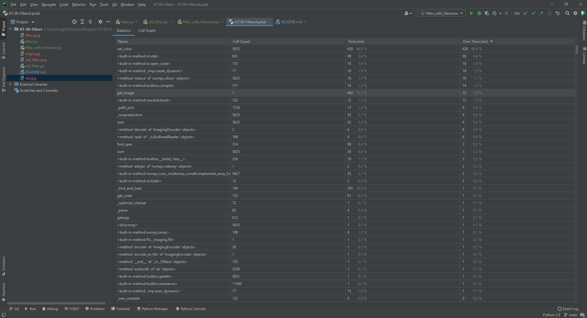

# AT-06-Filters
Время выполнения filter.py

Время выполнения old_filter.py

Разница сильно большая из-за ввода данных

И время нового файла без ввода данных

Разница времени отличается в 3 раза, новая версия быстрее

Изображение до преобразования

И после

